<p align="center">
  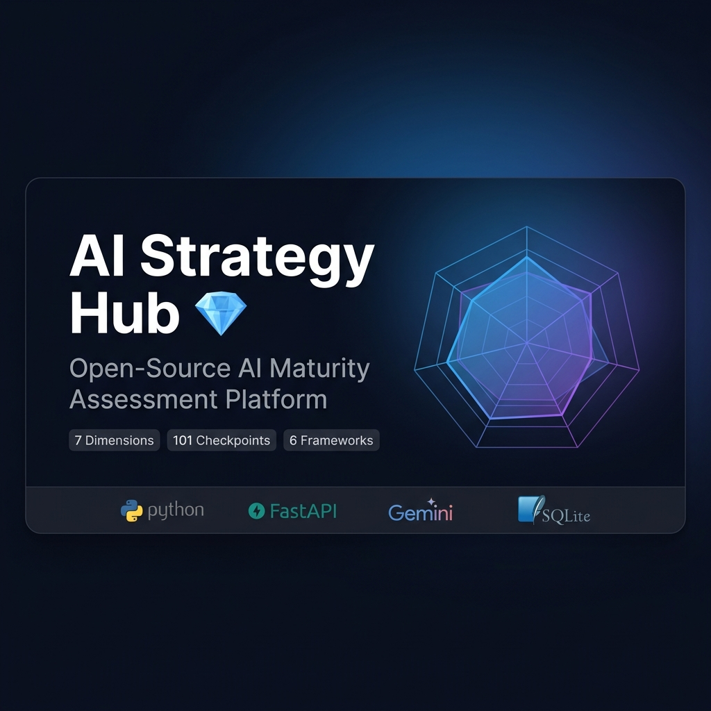
</p>

<p align="center">
  <strong>Open-Source AI Maturity Assessment Platform</strong><br>
  <em>Synthesizing 6 global standards into one actionable framework — powered by Gemini AI.</em>
</p>

<p align="center">
  <a href="https://github.com/jonasarmbrust/AIStrategyHub/actions/workflows/ci.yml"></a>
  <a href="LICENSE"></a>
  <a href="https://ai-strategy-hub-384210760656.europe-west1.run.app"></a>
  
  
  
  
  
</p>

<p align="center">
  
  
  
  
  
</p>

---

<p align="center">
  <strong>🚀 <a href="https://ai-strategy-hub-384210760656.europe-west1.run.app">Try the Live Demo →</a></strong><br>
  <sub>Hosted on Google Cloud Run — protected instance. <a href="https://github.com/jonasarmbrust/AIStrategyHub/issues/new?title=Demo+Access+Request&labels=demo-access">Request access</a> or <a href="mailto:jonas.armbrust@outlook.de">contact me</a> for a demo key.</sub>
</p>

---

## 💡 Why This Exists

The AI landscape is evolving at breakneck speed. New frameworks, regulations, and best practices emerge almost weekly — from the **EU AI Act** to **NIST AI RMF**, from **Google's AI Adoption Framework** to **OWASP's AI Security Guide**. There is an incredible wealth of knowledge out there on how to build a sustainable and effective AI strategy — but it's scattered across dozens of sources, each with its own structure, language, and focus.

**AI Strategy Hub** brings it all together. It lets you **build your own meta-framework**, continuously extend it with new research, and **test your AI strategy** against it — checkpoint by checkpoint, maturity level by maturity level. Instead of paying a consulting firm $50K+ for a one-time assessment, you get a living, evolving tool that grows with your organization.

> **101 checkpoints. 7 dimensions. 6 global standards. Full traceability. Zero vendor lock-in.**

---

## ✨ Key Features

<table>
<tr><td width="50%">

### 🧠 AI Strategy Advisor
Interactive chatbot powered by **Gemini 3.1 Pro** — knows your assessment scores, gaps, and research sources. Provides context-aware strategic advice.

### 📊 Maturity Assessment
Interactive checklist across 7 weighted dimensions with automated scoring, radar chart visualization, and level classification (1–5).

### 🔍 Document Analyzer (RAG)
Drag & drop your AI strategy docs (PDF, DOCX, TXT). The **RAG pipeline** uses embeddings + Gemini to evaluate all 101 checkpoints with confidence scoring.

### 🔗 Evidence Chain
Full traceability — click any checkpoint to see the AI's reasoning, evidence text, confidence %, and the original source chunks.

### ⚖️ EU AI Act Compliance
Maps gaps directly to EU AI Act requirements with compliance readiness score, regulatory exposure level, and article-level fine amounts.

### 🎮 Gap Simulator
"What-If Analysis" — toggle checkpoints and see real-time impact on your maturity score. Discover highest-ROI actions.

### 🕐 Assessment Timeline `NEW`
Track your AI maturity over time. Every assessment is saved as a snapshot — the dashboard shows score progression with deltas and visual comparison.

### 📋 Checkpoint Progress `NEW`
Animated progress ring showing X/101 checkpoints fulfilled with per-dimension mini bars. See exactly where you stand at a glance.

</td><td width="50%">

### 🔬 Research Agent
Automated web research via Tavily API. Discovers new frameworks & regulations, evaluates relevance with Gemini.

### 🏗️ Framework Builder
Extract novel checkpoints from research documents and integrate them into the living meta-model. The framework evolves.

### 🗺️ Strategic Roadmap
AI-generated prioritized action plan with effort estimates, quick wins, and milestone recommendations.

### 📄 Executive PDF Report
Branded AI Maturity Briefing powered by Gemini 3.1 Pro. One-click PDF export with scores, recommendations, and narrative.

### 🧭 Meta Strategy
Comprehensive Do's & Don'ts guide per dimension — what each framework recommends, with severity ratings.

### 🌍 Fully Bilingual (EN/DE)
Every UI element, report, and AI response is available in **English and German** — toggle with one click.

### 🔗 Dependency Map `NEW`
Interactive force-directed graph visualization of checkpoint relationships. Nodes colored by dimension, sized by maturity level. Drag, click, explore.

### ☀️ Dark / Light Mode `NEW`
Premium dark mode by default with full light theme toggle. Respects OS preference, persists across sessions.

</td></tr>
</table>

---

## 📸 Screenshots

<p align="center">
  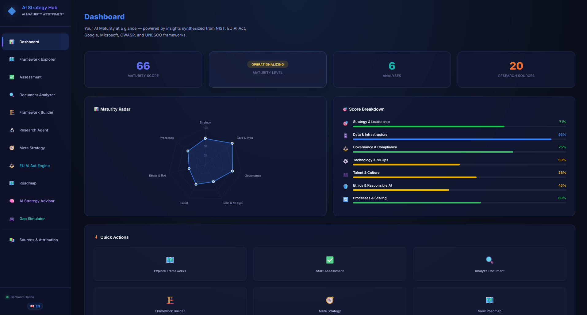
  <br><em>Dashboard — Your AI maturity at a glance with radar chart and dimension scores</em>
</p>

| Framework Explorer | Maturity Assessment |
|--------------------|---------------------|
| 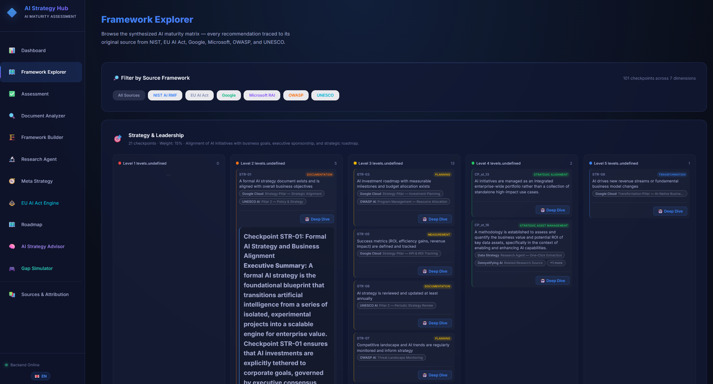 | 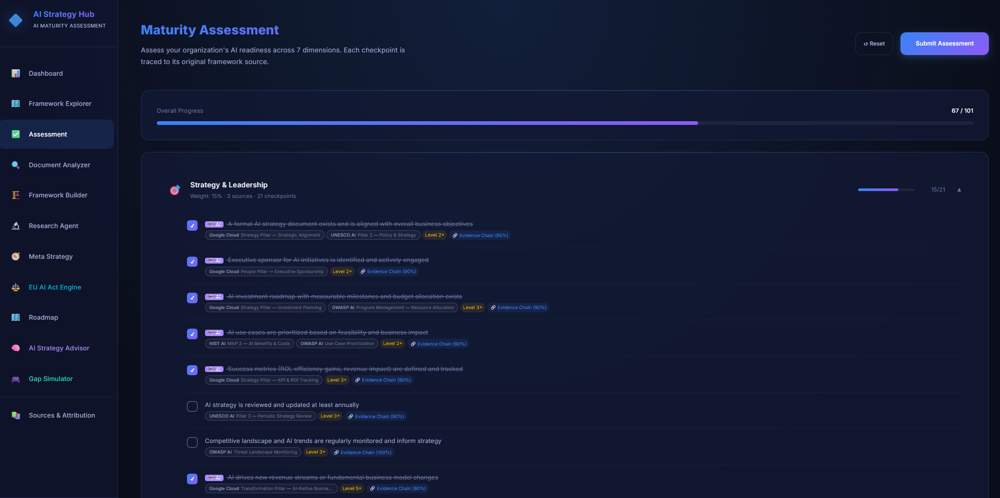 |
| *Browse all 101 checkpoints with source traceability and AI Deep Dives* | *Interactive checklist with evidence chains and confidence scores* |

| Document Analyzer (RAG) | AI Strategy Advisor |
|-------------------------|---------------------|
| 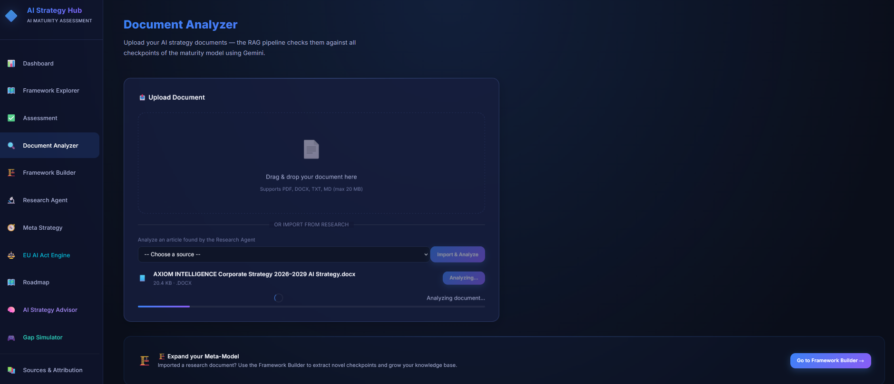 | 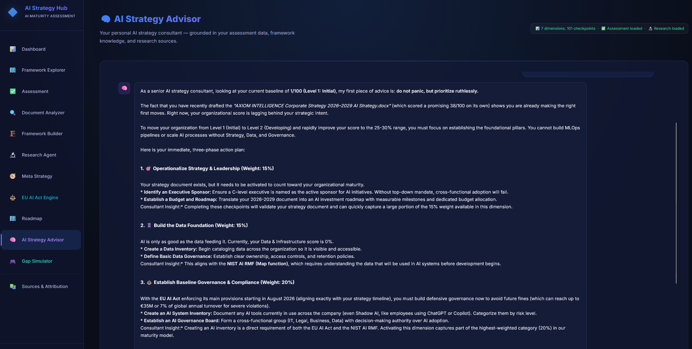 |
| *Upload strategy docs — AI evaluates every checkpoint automatically* | *Context-aware AI consultant powered by Gemini* |

| EU AI Act Compliance | Meta Strategy (Do's & Don'ts) |
|----------------------|-------------------------------|
| 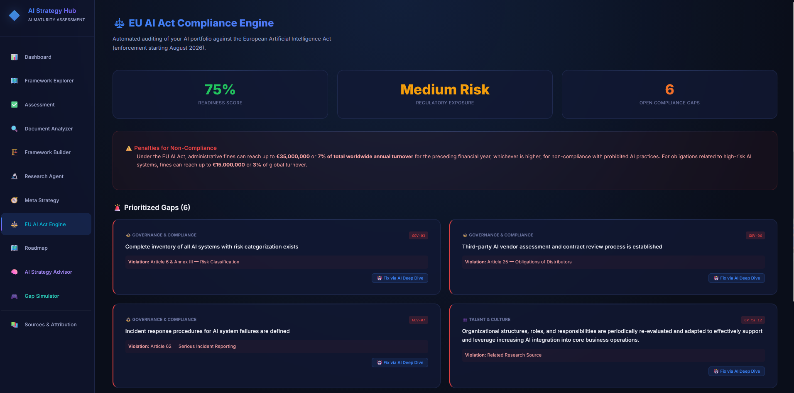 | 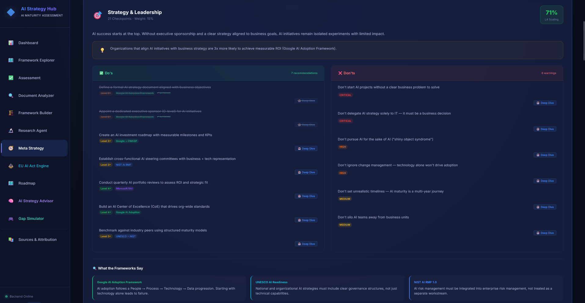 |
| *Regulatory gap analysis with article-level compliance mapping* | *Best practices from all 6 frameworks with severity ratings* |

| Research Agent | Sources & Attribution |
|----------------|-----------------------|
| 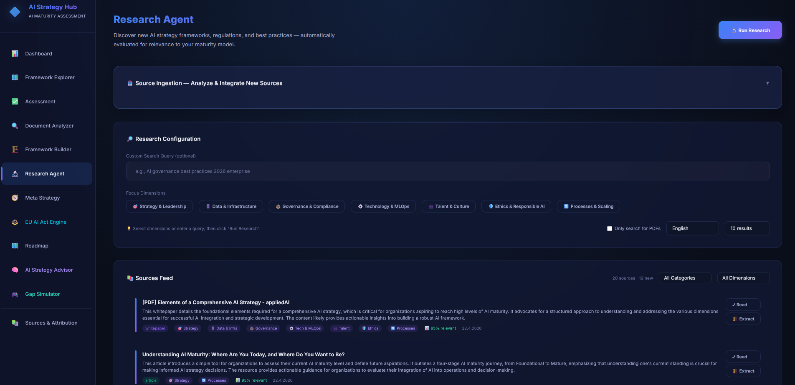 | 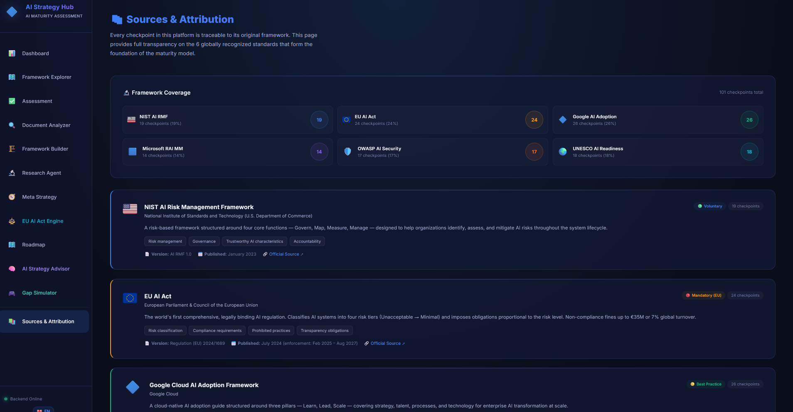 |
| *Automated web research with relevance scoring per dimension* | *Full transparency — every checkpoint traced to its origin* |

---

## 🏗️ Architecture

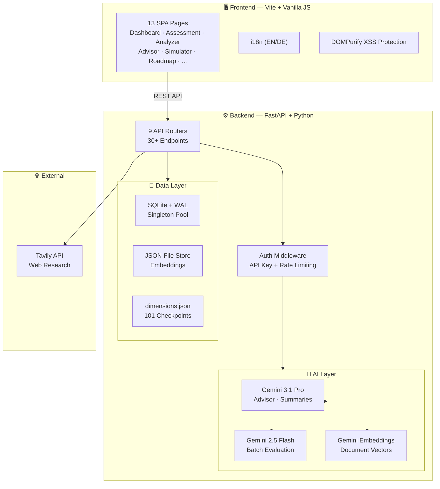

---

## 🛠️ Tech Stack

| Layer | Technology | Purpose |
|-------|-----------|---------|
| **Frontend** | Vite, Vanilla JS, Chart.js | SPA with hash routing, radar charts |
| **Backend** | Python 3.12, FastAPI, Uvicorn | Async API, 30+ endpoints |
| **AI** | Gemini 3.1 Pro, 2.5 Flash, Embeddings | Reasoning, batch eval, vector search |
| **Database** | SQLite (aiosqlite, WAL mode) | Assessments, analyses, research |
| **Research** | Tavily API | Automated web research agent |
| **Security** | DOMPurify, API Key Auth, slowapi | XSS protection, auth, rate limiting |
| **DevOps** | Docker, GitHub Actions, Alembic | Multi-stage build, CI/CD, migrations |
| **Design** | Custom CSS (2300+ LOC) | Glassmorphism, dark mode, Inter font |

---

## 🚀 Quick Start

### Prerequisites

- **API Keys** (required):
  - [Gemini API Key](https://aistudio.google.com/app/apikey) — powers AI features
  - [Tavily API Key](https://tavily.com) — powers research agent
- **Runtime**: Docker (recommended) OR Python 3.12+ & Node.js 18+

### Setup

```bash
git clone https://github.com/jonasarmbrust/AIStrategyHub.git
cd AIStrategyHub
cp .env.example .env
# ⚠️ Edit .env with your API keys!
```

<details>
<summary><strong>Option 1: Docker (Easiest)</strong></summary>

```bash
docker compose up -d --build
```
Open **http://localhost:8000**

</details>

<details>
<summary><strong>Option 2: Local Script (Windows)</strong></summary>

```cmd
start.bat
```
Builds frontend automatically and starts the backend.

</details>

<details>
<summary><strong>Option 3: Manual Install</strong></summary>

```bash
# Frontend
cd frontend && npm install && npm run build && cd ..

# Backend
cd backend && pip install -r requirements.txt
python -m uvicorn main:app --port 8000
```
Open **http://localhost:8000**

</details>

### Optional: Enable Authentication

```bash
# In .env — set an API key to protect all endpoints
API_AUTH_KEY=your-secret-key-here
```

Clients must then send `X-API-Key: your-secret-key-here` header with every request.

---

## 📊 The Maturity Framework

The meta-model synthesizes **6 globally recognized frameworks** into **7 unified dimensions** with **101 checkpoints**:

| Dimension | Weight | Checkpoints | Focus |
|-----------|--------|-------------|-------|
| 🎯 Strategy & Leadership | 15% | 21 | Executive sponsorship, AI-business alignment |
| 🗄️ Data & Infrastructure | 15% | 14 | Data governance, quality, scalable infra |
| ⚖️ Governance & Compliance | 20% | 16 | AI risk management, EU AI Act, audit |
| ⚙️ Technology & MLOps | 15% | 12 | CI/CD for ML, monitoring, deployment |
| 👥 Talent & Culture | 10% | 12 | AI literacy, cross-functional teams |
| 🛡️ Ethics & Responsible AI | 15% | 11 | Bias testing, explainability, privacy |
| 🔄 Processes & Scaling | 10% | 15 | Pilot-to-production, change management |

### Source Frameworks

Every checkpoint is fully traceable to its origin:

| Framework | Focus Area |
|-----------|-----------|
| **NIST AI RMF** | Risk management & governance structure |
| **EU AI Act** | Regulatory compliance & risk classification |
| **Google AI Adoption Framework** | Cloud-native AI scaling |
| **Microsoft Responsible AI MM** | RAI practices at scale |
| **OWASP AI Security Matrix** | AI-specific security threats |
| **UNESCO AI Readiness** | National & organizational readiness |

### Maturity Levels

| Level | Name | Score Range | Description |
|-------|------|-------------|-------------|
| 1 | **Initial** | 0–24% | Ad-hoc, no structured AI approach |
| 2 | **Developing** | 25–49% | Early pilots, partial processes |
| 3 | **Defined** | 50–69% | Established practices, documented |
| 4 | **Managed** | 70–89% | Organization-wide, measured |
| 5 | **Optimizing** | 90–100% | Industry-leading, continuous improvement |

---

## 📁 Project Structure

```
AIStrategyHub/
├── backend/
│   ├── main.py                    # FastAPI entry point
│   ├── config.py                  # Centralized config & dependencies
│   ├── database.py                # SQLite singleton pool (WAL mode)
│   ├── api/routes/                # 9 API routers (30+ endpoints)
│   ├── analyzer/                  # RAG pipeline (embedder, evaluator, parser)
│   ├── knowledge_base/
│   │   └── dimensions.json        # Living Meta-Model (101 checkpoints)
│   ├── middleware/                 # Auth, rate limiting, error handling
│   ├── models/schemas.py          # Pydantic data contracts
│   ├── research/agent.py          # Tavily research agent
│   ├── migrations/                # Alembic DB migrations
│   └── tests/                     # pytest suite (21 tests)
├── frontend/
│   ├── index.html                 # SPA shell + navigation
│   └── src/
│       ├── main.js                # Router + API client
│       ├── i18n.js                # Bilingual dictionary (EN/DE)
│       ├── sanitize.js            # DOMPurify XSS protection
│       ├── styles/index.css       # Design system (2300+ LOC)
│       └── pages/                 # 13 page modules
├── .github/workflows/ci.yml      # CI/CD pipeline
├── Dockerfile                     # Multi-stage production build
├── docker-compose.yml             # One-command deployment
└── .env.example                   # Environment configuration template
```

---

## 🔒 Security

| Feature | Implementation |
|---------|---------------|
| **XSS Protection** | DOMPurify sanitization on all LLM-generated content |
| **API Authentication** | Optional `X-API-Key` header middleware |
| **Rate Limiting** | slowapi with configurable per-endpoint limits |
| **SQL Injection** | Parameterized queries throughout |
| **Error Handling** | Standardized error responses, no stack traces in production |
| **Input Validation** | Pydantic models + file type whitelisting |

---

## 📖 API Documentation

The backend automatically generates interactive API documentation:

- **Swagger UI**: `http://localhost:8000/docs`
- **ReDoc**: `http://localhost:8000/redoc`

---

## 🧪 Testing

```bash
cd backend
pytest tests/ -v
```

Currently **21 tests** covering:
- Health & infrastructure endpoints
- Scoring engine (8 unit tests with edge cases)
- Checklist API (filters, dimensions)
- Document analysis (upload, validation, listing)

---

## 🤝 Contributing

We welcome contributions! Whether it's expanding the maturity model, adding new checkpoints, or improving the codebase — every contribution makes AI governance more accessible.

- 📖 [Contributing Guide](CONTRIBUTING.md)
- 📜 [Code of Conduct](CODE_OF_CONDUCT.md)
- 🐛 [Report a Bug](.github/ISSUE_TEMPLATE/bug_report.yml)
- 💡 [Request a Feature](.github/ISSUE_TEMPLATE/feature_request.yml)

The most impactful contribution? **Expanding `dimensions.json`** with checkpoints from new frameworks. Use the built-in Framework Builder to extract and integrate them automatically.

---

## 📄 License

MIT License — see [LICENSE](LICENSE) for details.

---

## ⚖️ Disclaimer & Attribution

AI Strategy Hub is an **independent, open-source project**. It is **not affiliated with, endorsed by, or sponsored by** any of the organizations whose frameworks are referenced in this tool.

The maturity model synthesizes publicly available concepts from [NIST](https://airc.nist.gov/AI_RMF_Playbook), the [European Union](https://eur-lex.europa.eu/eli/reg/2024/1689), [Google Cloud](https://cloud.google.com/adoption-framework/ai), [Microsoft](https://www.microsoft.com/en-us/ai/responsible-ai), [OWASP](https://owasp.org/www-project-ai-security-and-privacy-guide/), and [UNESCO](https://www.unesco.org/en/artificial-intelligence/recommendation-ethics) into an independently authored assessment framework. All checkpoint texts are **original formulations** by the project authors — no content is copied verbatim from any source publication.

Framework names are used solely for **attribution and source identification** purposes. For authoritative guidance, always refer to the official publications linked in the app's [Sources & Attribution](backend/knowledge_base/sources/) section.

<details>
<summary>Trademark Notice</summary>

NIST is a registered trademark of the National Institute of Standards and Technology. Google Cloud is a trademark of Google LLC. Microsoft is a registered trademark of Microsoft Corporation. OWASP is a registered trademark of the OWASP Foundation. All other trademarks are the property of their respective owners.

</details>

---

<p align="center">
  <strong>AI Strategy Hub</strong> — Built with Gemini, FastAPI, and a lot of ☕<br>
  <em>Assess. Analyze. Optimize.</em><br><br>
  <a href="https://github.com/jonasarmbrust/AIStrategyHub">⭐ Star this repo</a> if you find it useful!
</p>
