<p align="center">
  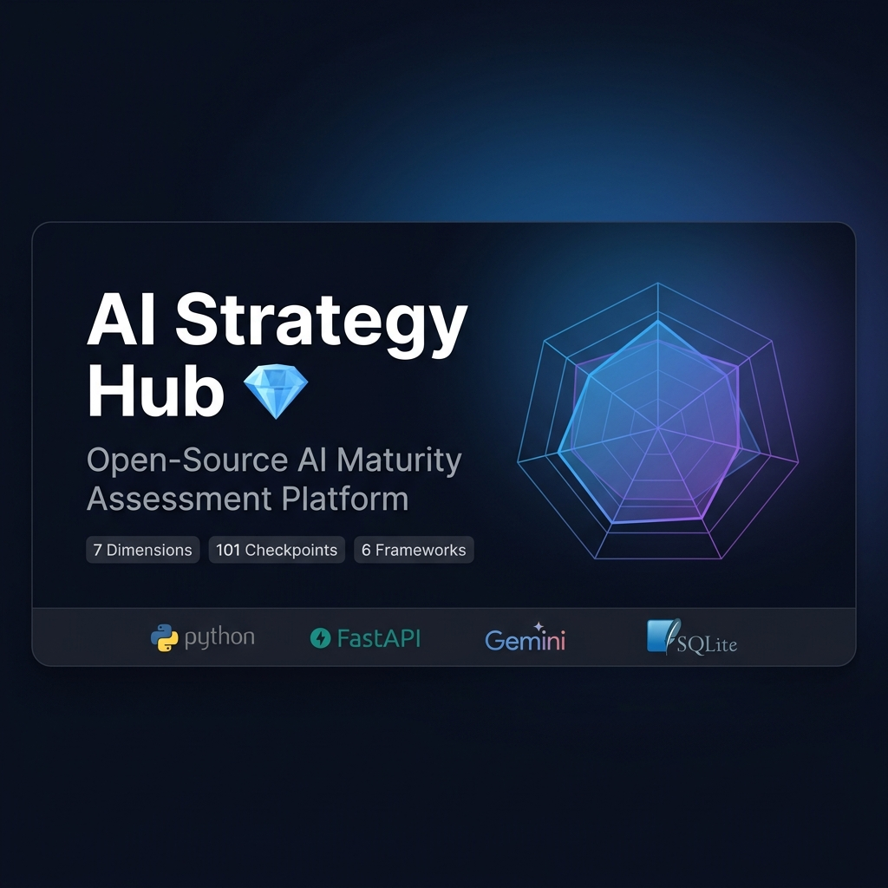
</p>

<p align="center">
  <strong>Is your organization truly ready for AI? Find out — for free.</strong><br>
  <em>An open-source platform that helps you assess, plan, and track your AI strategy<br>using best practices from 6 global standards — powered by Google Gemini AI.<br>And it evolves itself.</em>
</p>

<p align="center">
  <a href="https://github.com/jonasarmbrust/AIStrategyHub/actions/workflows/ci.yml"></a>
  <a href="LICENSE"></a>
  <a href="https://ai-strategy-hub-384210760656.europe-west1.run.app"></a>
  
  
  
  
  
</p>

<p align="center">
  
  
  
  
  
</p>

---

<p align="center">
  <strong>🚀 <a href="https://ai-strategy-hub-384210760656.europe-west1.run.app">Try the Live Demo →</a></strong><br>
  <sub>Hosted on Google Cloud Run — protected instance. <a href="https://github.com/jonasarmbrust/AIStrategyHub/issues/new?title=Demo+Access+Request&labels=demo-access">Request access</a> or <a href="mailto:jonas.armbrust@outlook.de">contact me</a> for a demo key.</sub>
</p>

---

## 💡 What Is This?

**In one sentence:** AI Strategy Hub is a free, self-evolving tool that tells you how ready your organization is for AI — and autonomously keeps your assessment framework current.

### The Problem

Every company knows they *should* be using AI. But most don't know **where to start**, **what they're missing**, or **how mature their current approach actually is**. Meanwhile, dozens of excellent guides exist — from the EU AI Act to Google's AI Adoption Framework — but they each have different formats, focus areas, and languages. Reading them all would take weeks.

And hiring a consultancy? That's **costly, slow, and gives you a one-time snapshot** that's outdated within months — especially in a field where new regulations, tools, and best practices emerge almost weekly.

**Traditional maturity models have an even deeper flaw**: they're frozen the moment they're published. The AI landscape evolves weekly; your assessment framework should too.

### The Solution

AI Strategy Hub **merges 6 internationally recognized standards** (NIST, EU AI Act, Google, Microsoft, OWASP, UNESCO) into a **living meta-model** across 7 key areas — and then **evolves it autonomously**. You can:

- 🧬 **Let the AI evolve your framework** — The Evolution Agent autonomously researches new standards, generates checkpoint proposals, detects redundancies, and integrates approved changes on a configurable schedule. The framework has already grown from 101 → 190+ checkpoints this way.
- ✅ **Self-assess** — Walk through an interactive checklist and get your maturity score instantly
- 📄 **Upload existing strategy documents** — The AI reads them and evaluates your readiness automatically
- 📋 **Follow the AI Playbook** — A phased implementation roadmap (Foundation → Transformation) with effort estimates and priority badges
- 🧠 **Ask the AI Advisor** — "What should we focus on first?" — and get answers based on *your specific gaps*
- 📈 **Track progress over time** — Every assessment becomes a snapshot, so you can see how you improve
- 🔬 **Stay current — automatically** — The Evolution Agent scans the web for new frameworks and regulations, so you never fall behind

> **Think of it as a fitness tracker for your AI strategy** — instead of steps and heart rate, it measures governance, data readiness, talent, and ethics. And unlike a static report, **it gets smarter over time**.

> [!TIP]
> **The AI world moves fast. Your assessment tool should too.** Traditional maturity models are frozen the moment they're published. AI Strategy Hub's Evolution Agent autonomously discovers, evaluates, and proposes new checkpoints — keeping your framework as current as the field itself.

### Who Is This For?

| Role | What you get |
|------|-------------|
| **CTO / Head of AI** | A clear picture of organizational AI readiness with concrete action items |
| **IT Project Manager** | A structured framework to plan and prioritize AI initiatives |
| **Compliance / Legal** | EU AI Act gap analysis with article-level mapping and risk scores |
| **Consultant / Advisor** | A reusable assessment tool for client engagements — free and white-label-ready |
| **Student / Researcher** | A hands-on way to learn about AI governance frameworks |

---

## 🧬 The Evolution Strategy — Agentic Framework Evolution

<p align="center">
  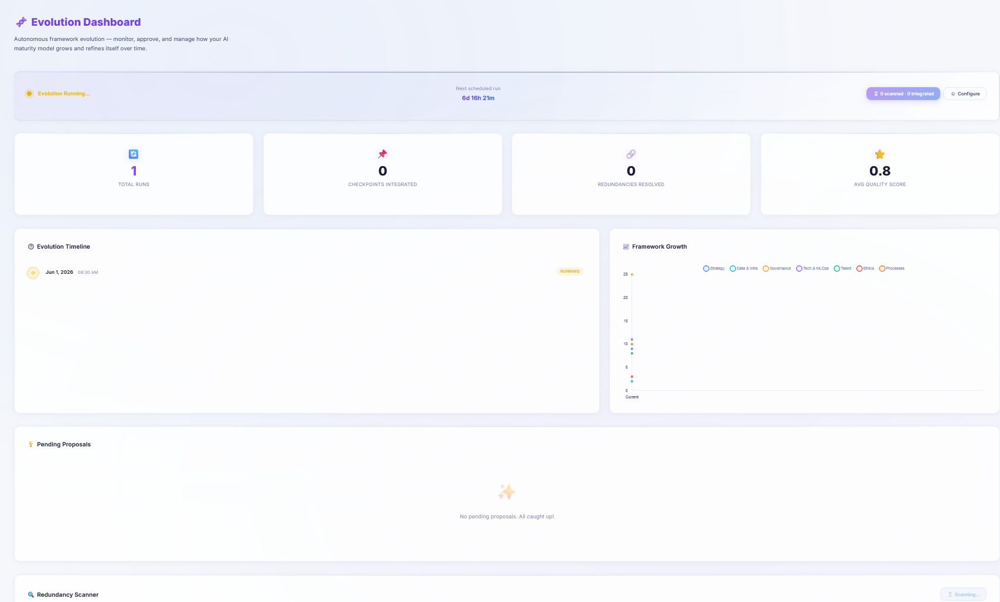
  <br><em>Evolution Dashboard — Monitor, approve, and manage how your AI maturity model grows and refines itself over time</em>
</p>

**This is what makes AI Strategy Hub fundamentally different from every other maturity model.**

Traditional assessment frameworks are static documents — published once, then frozen. AI Strategy Hub's **Evolution Engine** is an autonomous agent that continuously improves the underlying framework:

### How It Works

```
┌─────────────────────────────────────────────────────────────────────┐
│                    🧬 EVOLUTION CYCLE                               │
│                                                                     │
│   ┌──────────┐    ┌──────────┐    ┌──────────┐    ┌──────────┐     │
│   │ Research  │───▶│ Evaluate │───▶│ Propose  │───▶│ Dedupe   │     │
│   │  Scan    │    │ (Gemini) │    │Checkpoints│   │(Embeddings)│    │
│   └──────────┘    └──────────┘    └──────────┘    └──────────┘     │
│        │                                               │            │
│        │              ┌──────────┐                     │            │
│        │              │  Human   │◀────────────────────┘            │
│        │              │  Review  │                                  │
│        │              └────┬─────┘                                  │
│        │                   │ Approve / Reject                       │
│        │              ┌────▼─────┐                                  │
│        │              │Integrate │                                  │
│        │              │  & Lock  │                                  │
│        │              └────┬─────┘                                  │
│        │                   │                                        │
│        ▼                   ▼                                        │
│   ┌────────────────────────────────────┐                            │
│   │ 📊 Living Meta-Model (190+ CPs)   │                            │
│   │    Snapshots · Rollback · Growth   │                            │
│   └────────────────────────────────────┘                            │
└─────────────────────────────────────────────────────────────────────┘
```

1. **🔬 Automated Research Scanning** — The Evolution Agent triggers Tavily-powered web research across all 7 dimensions, discovering new AI governance frameworks, regulations, and academic papers.

2. **🧠 AI-Powered Evaluation** — Each research result is evaluated by Gemini against all existing checkpoints using multi-criteria assessment (quality, impact, novelty).

3. **📝 Checkpoint Proposal Generation** — Gemini generates concrete new checkpoint proposals with dimension assignment, maturity level, source attribution, and quality scores.

4. **🔍 Embedding-Based Deduplication** — A Redundancy Scanner uses Gemini embeddings + cosine similarity to detect semantically duplicate checkpoints and flags them for merging.

5. **👤 Human-in-the-Loop Review** — All proposals are queued in the Evolution Dashboard for human approval or rejection — full transparency, full control.

6. **🔒 Atomic Integration** — Approved checkpoints are merged into the living meta-model with `CrossProcessFileLock` for safe concurrent writes.

7. **⏰ Scheduled Autonomy** — Configurable cron-like scheduling (weekly by default) — the framework evolves on autopilot while you review.

### Evolution Dashboard Features

| Feature | Description |
|---------|-------------|
| **Live Status Bar** | Real-time evolution status with countdown to next scheduled run |
| **KPI Cards** | Total runs, checkpoints integrated, redundancies resolved, avg quality score |
| **Evolution Timeline** | Chronological log of all evolution runs with expandable details |
| **Framework Growth Chart** | Stacked visualization of checkpoint count growth per dimension |
| **Pending Proposals Queue** | AI-generated proposals with quality/impact/novelty scores — approve or reject |
| **Redundancy Scanner** | Side-by-side comparison of semantically similar checkpoints with similarity % |
| **Snapshot & Rollback** | Framework versioning with one-click rollback to any previous state |
| **Configuration Panel** | Schedule frequency, auto-approve toggle, quality thresholds |

> [!IMPORTANT]
> **From 101 to 190+ checkpoints — autonomously.** The Evolution Engine has already nearly doubled the framework's coverage by discovering and integrating checkpoints from sources like arXiv papers, MIT Sloan Management Review, appliedAI, and Google's Data & AI Strategy Assessment.

---

## ✨ Key Features

<table>
<tr><td width="50%">

### 🧬 Evolution Agent `NEW`
Autonomous framework evolution — researches new standards, generates checkpoint proposals, detects redundancies, integrates approved changes on a configurable schedule. The framework evolves itself.

### 📋 AI Strategy Playbook `NEW`
Phased implementation roadmap (Foundation → Experimentation → Operationalization → Scaling → Transformation) with effort estimates, priority badges, and per-dimension progress tracking.

### 🔬 AI Deep Dives `NEW`
Per-checkpoint detailed analysis powered by Gemini. In-depth implementation guidance and best practices — connected from EU AI Act gaps ("Fix via AI Deep Dive").

### 🧠 AI Strategy Advisor
Interactive chatbot powered by **Gemini 2.5 Pro** — knows your assessment scores, gaps, and research sources. Provides context-aware strategic advice.

### 📊 Maturity Assessment
Interactive checklist across 7 weighted dimensions with automated scoring, radar chart visualization, and level classification (1–5).

### 🔍 Document Analyzer (RAG)
Drag & drop your AI strategy docs (PDF, DOCX, TXT). The **RAG pipeline** uses embeddings + Gemini to evaluate all checkpoints with confidence scoring.

</td><td width="50%">

### 🔗 Evidence Chain
Full traceability — click any checkpoint to see the AI's reasoning, evidence text, confidence %, and the original source chunks.

### ⚖️ EU AI Act Compliance
Maps gaps directly to EU AI Act requirements with compliance readiness score, regulatory exposure level, and article-level fine amounts.

### 🎮 Gap Simulator
"What-If Analysis" — toggle checkpoints and see real-time impact on your maturity score. Discover highest-ROI actions.

### 🔬 Research Agent
Automated web research via Tavily API. Discovers new frameworks & regulations, evaluates relevance with Gemini. Feeds directly into the Evolution Engine.

### 🏗️ Framework Builder
Extract novel checkpoints from research documents and integrate them into the living meta-model. The framework evolves.

### 🕐 Assessment Timeline
Track your AI maturity over time. Every assessment is saved as a snapshot — the dashboard shows score progression with deltas and visual comparison.

### 🗺️ Strategic Roadmap
AI-generated prioritized action plan with effort estimates, quick wins, and milestone recommendations.

### 🌍 Fully Bilingual (EN/DE)
Every UI element, report, and AI response is available in **English and German** — toggle with one click.

</td></tr>
</table>

---

## 📸 Screenshots

<p align="center">
  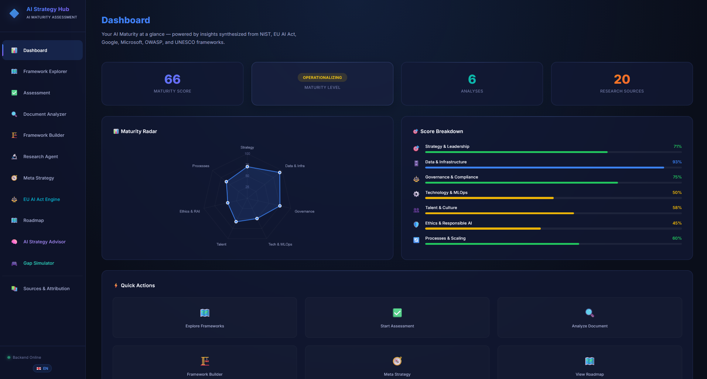
  <br><em>Dashboard — Your AI maturity at a glance with radar chart and dimension scores</em>
</p>

| Evolution Dashboard | AI Strategy Playbook |
|---------------------|----------------------|
|  | 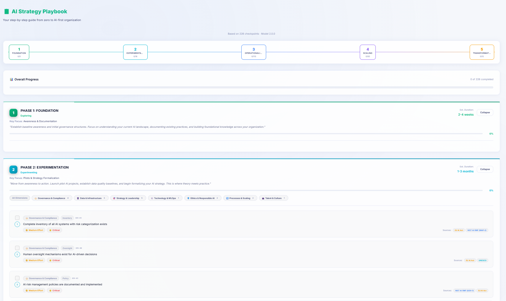 |
| *Autonomous framework evolution — monitor runs, approve proposals, track growth* | *Phased implementation guide from Foundation to Transformation* |

| Document Analyzer (RAG) | AI Strategy Advisor |
|-------------------------|---------------------|
| 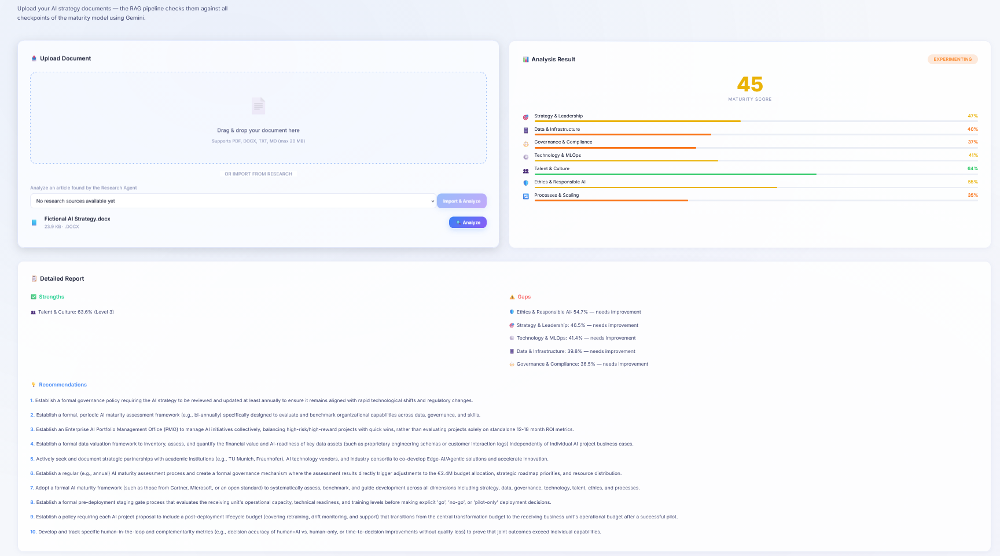 | 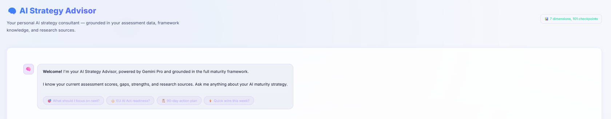 |
| *Upload strategy docs — AI evaluates every checkpoint with strengths & gaps* | *Context-aware AI consultant powered by Gemini* |

| EU AI Act Compliance | Gap Simulator |
|----------------------|---------------|
| 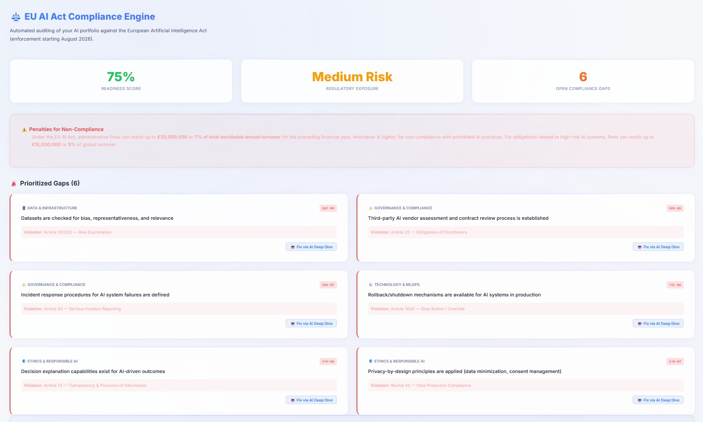 | 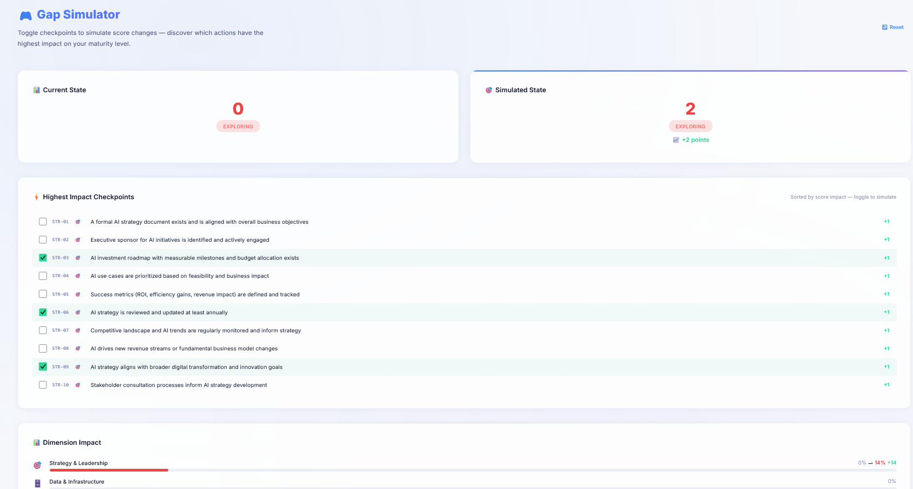 |
| *Regulatory gap analysis with article-level compliance mapping & fines* | *What-If analysis — toggle checkpoints and see real-time score impact* |

| Dependency Map | Framework Explorer |
|----------------|---------------------|
| 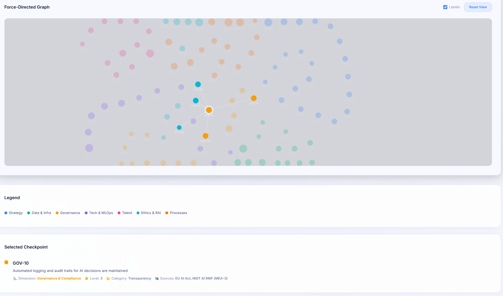 | 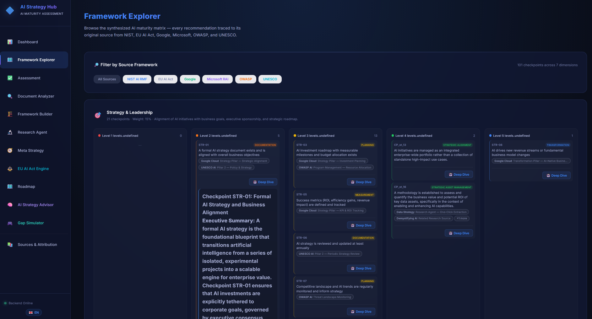 |
| *Interactive force-directed graph of checkpoint relationships* | *Browse all checkpoints with source traceability and AI Deep Dives* |

---

## 🏗️ Architecture

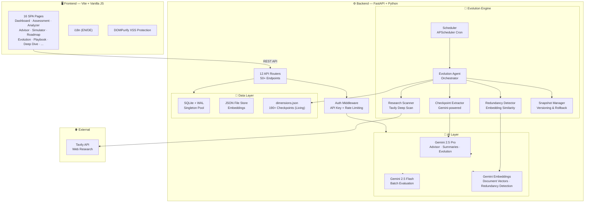
```mermaid
graph TB
    subgraph Frontend["🖥️ Frontend — Vite + Vanilla JS"]
        FE_PAGES["16 SPA Pages<br/>Dashboard · Assessment · Analyzer<br/>Advisor · Simulator · Roadmap<br/>Evolution · Playbook · Deep Dive · ..."]
        FE_I18N["i18n (EN/DE)"]
        FE_SANITIZE["DOMPurify XSS Protection"]
    end

    subgraph Backend["⚙️ Backend — FastAPI + Python"]
        ROUTES["12 API Routers<br/>50+ Endpoints"]
        AUTH["Auth Middleware<br/>API Key + Rate Limiting"]
        
        subgraph AI["🧠 AI Layer"]
            GEMINI_PRO["Gemini 2.5 Pro<br/>Advisor · Summaries · Evolution"]
            GEMINI_FLASH["Gemini 2.5 Flash<br/>Batch Evaluation"]
            GEMINI_EMBED["Gemini Embeddings<br/>Document Vectors · Redundancy Detection"]
        end

        subgraph Evolution["🧬 Evolution Engine"]
            EVO_AGENT["Evolution Agent<br/>Orchestrator"]
            EVO_EXTRACT["Checkpoint Extractor<br/>Gemini-powered"]
            EVO_REDUNDANCY["Redundancy Detector<br/>Embedding Similarity"]
            EVO_SCANNER["Research Scanner<br/>Tavily Deep Scan"]
            EVO_SNAPSHOT["Snapshot Manager<br/>Versioning & Rollback"]
            EVO_SCHEDULER["Scheduler<br/>APScheduler Cron"]
        end
        
        subgraph Data["💾 Data Layer"]
            DB["SQLite + WAL<br/>Singleton Pool"]
            JSON_DB["JSON File Store<br/>Embeddings"]
            DIMS["dimensions.json<br/>190+ Checkpoints (Living)"]
        end
    end

    subgraph External["🌐 External"]
        TAVILY["Tavily API<br/>Web Research"]
    end

    FE_PAGES -->|REST API| ROUTES
    ROUTES --> AUTH
    AUTH --> AI
    ROUTES --> Data
    AI --> GEMINI_PRO & GEMINI_FLASH & GEMINI_EMBED
    EVO_AGENT --> EVO_EXTRACT & EVO_REDUNDANCY & EVO_SCANNER & EVO_SNAPSHOT
    EVO_SCHEDULER --> EVO_AGENT
    EVO_SCANNER --> TAVILY
    EVO_EXTRACT --> GEMINI_PRO
    EVO_REDUNDANCY --> GEMINI_EMBED
    EVO_AGENT --> DIMS
```

---

## 🛠️ Tech Stack

| Layer | Technology | Purpose |
|-------|-----------|---------| 
| **Frontend** | Vite, Vanilla JS, Chart.js | SPA with hash routing, radar charts, force-directed graphs |
| **Backend** | Python 3.12, FastAPI, Uvicorn | Async API, 50+ endpoints, 12 routers |
| **AI** | Gemini 2.5 Pro, 2.5 Flash, Embeddings | Reasoning, batch eval, vector search, evolution |
| **Evolution** | APScheduler, CrossProcessFileLock | Autonomous agent scheduling, safe concurrent writes |
| **Database** | SQLite (aiosqlite, WAL mode) | Assessments, analyses, research, evolution history |
| **Research** | Tavily API | Automated web research agent, evolution input pipeline |
| **Security** | DOMPurify, API Key Auth, slowapi | XSS protection, auth, rate limiting |
| **DevOps** | Docker, GitHub Actions, Alembic | Multi-stage build, CI/CD, migrations |
| **Design** | Custom CSS (3000+ LOC) | Glassmorphism, dark mode, Inter font |

---

## 🚀 Quick Start

### Prerequisites

- **API Keys** (required):
  - [Gemini API Key](https://aistudio.google.com/app/apikey) — powers AI features + evolution
  - [Tavily API Key](https://tavily.com) — powers research agent + evolution scanning
- **Runtime**: Docker (recommended) OR Python 3.12+ & Node.js 18+

### Setup

```bash
git clone https://github.com/jonasarmbrust/AIStrategyHub.git
cd AIStrategyHub
cp .env.example .env
# ⚠️ Edit .env with your API keys!
```

<details>
<summary><strong>Option 1: Docker (Easiest)</strong></summary>

```bash
docker compose up -d --build
```
Open **http://localhost:8000**

</details>

<details>
<summary><strong>Option 2: Local Script (Windows)</strong></summary>

```cmd
start.bat
```
Builds frontend automatically and starts the backend.

</details>

<details>
<summary><strong>Option 3: Manual Install</strong></summary>

```bash
# Frontend
cd frontend && npm install && npm run build && cd ..

# Backend
cd backend && pip install -r requirements.txt
python -m uvicorn main:app --port 8000
```
Open **http://localhost:8000**

</details>

### Optional: Enable Authentication

```bash
# In .env — set an API key to protect all endpoints
API_AUTH_KEY=your-secret-key-here
```

Clients must then send `X-API-Key: your-secret-key-here` header with every request.

### Optional: Configure Evolution Agent

```bash
# In .env — configure autonomous evolution
EVOLUTION_ENABLED=true
EVOLUTION_SCHEDULE=weekly          # weekly / daily / manual
EVOLUTION_AUTO_INTEGRATE=false     # require human approval
EVOLUTION_MIN_QUALITY=0.7          # minimum quality threshold
```

---

## 📊 The Maturity Framework

The meta-model synthesizes **6 globally recognized frameworks** into **7 unified dimensions** — and grows autonomously via the Evolution Engine:

| Dimension | Weight | Checkpoints | Focus |
|-----------|--------|-------------|-------|
| 🎯 Strategy & Leadership | 15% | 21+ | Executive sponsorship, AI-business alignment |
| 🗄️ Data & Infrastructure | 15% | 14+ | Data governance, quality, scalable infra |
| ⚖️ Governance & Compliance | 20% | 16+ | AI risk management, EU AI Act, audit |
| ⚙️ Technology & MLOps | 15% | 12+ | CI/CD for ML, monitoring, deployment |
| 👥 Talent & Culture | 10% | 12+ | AI literacy, cross-functional teams |
| 🛡️ Ethics & Responsible AI | 15% | 11+ | Bias testing, explainability, privacy |
| 🔄 Processes & Scaling | 10% | 15+ | Pilot-to-production, change management |

> [!NOTE]
> Checkpoint counts shown are the **base counts** from the original 6 frameworks. The Evolution Agent has expanded these significantly — the living model currently contains **190+ checkpoints** and continues to grow.

### Source Frameworks

Every checkpoint is fully traceable to its origin:

| Framework | Focus Area |
|-----------|-----------| 
| **NIST AI RMF** | Risk management & governance structure |
| **EU AI Act** | Regulatory compliance & risk classification |
| **Google AI Adoption Framework** | Cloud-native AI scaling |
| **Microsoft Responsible AI MM** | RAI practices at scale |
| **OWASP AI Security Matrix** | AI-specific security threats |
| **UNESCO AI Readiness** | National & organizational readiness |

The Evolution Agent continuously discovers and proposes checkpoints from **additional sources** including arXiv papers, MIT Sloan Management Review, appliedAI, and more.

### Maturity Levels

| Level | Name | Score Range | Description |
|-------|------|-------------|-------------|
| 1 | **Initial** | 0–24% | Ad-hoc, no structured AI approach |
| 2 | **Developing** | 25–49% | Early pilots, partial processes |
| 3 | **Defined** | 50–69% | Established practices, documented |
| 4 | **Managed** | 70–89% | Organization-wide, measured |
| 5 | **Optimizing** | 90–100% | Industry-leading, continuous improvement |

---

## 📁 Project Structure

```
AIStrategyHub/
├── backend/
│   ├── main.py                    # FastAPI entry point
│   ├── config.py                  # Centralized config & dependencies
│   ├── database.py                # SQLite singleton pool (WAL mode)
│   ├── api/routes/                # 12 API routers (50+ endpoints)
│   │   ├── evolution.py           # 🧬 Evolution Agent (~20 endpoints)
│   │   ├── framework.py           # 🏗️ Framework Builder
│   │   ├── research.py            # 🔬 Research Agent
│   │   ├── advisor.py             # 🧠 AI Advisor
│   │   └── ...                    # analysis, checklist, dashboard, etc.
│   ├── evolution/                  # 🧬 Evolution Engine
│   │   ├── agent.py               # Core Evolution Agent orchestrator
│   │   ├── checkpoint_extractor.py # Gemini-powered extraction
│   │   ├── redundancy_detector.py  # Embedding similarity deduplication
│   │   ├── research_scanner.py     # Tavily deep research scan
│   │   ├── snapshot_manager.py     # Framework versioning & rollback
│   │   ├── scheduler.py           # APScheduler cron scheduling
│   │   └── prompts.py             # LLM prompt templates
│   ├── analyzer/                  # RAG pipeline (embedder, evaluator, parser)
│   ├── knowledge_base/
│   │   └── dimensions.json        # Living Meta-Model (190+ checkpoints)
│   ├── middleware/                 # Auth, rate limiting, error handling
│   ├── models/schemas.py          # Pydantic data contracts
│   ├── research/agent.py          # Tavily research agent
│   ├── migrations/                # Alembic DB migrations
│   └── tests/                     # pytest suite (45 tests)
├── frontend/
│   ├── index.html                 # SPA shell + navigation (15 nav items)
│   └── src/
│       ├── main.js                # Router + API client
│       ├── i18n.js                # Bilingual dictionary (EN/DE)
│       ├── sanitize.js            # DOMPurify XSS protection
│       ├── styles/index.css       # Design system (3000+ LOC)
│       └── pages/                 # 16 page modules
│           ├── evolution.js       # 🧬 Evolution Dashboard (largest page)
│           ├── playbook.js        # 📋 AI Strategy Playbook
│           └── ...                # 14 more pages
├── .github/workflows/ci.yml      # CI/CD pipeline
├── Dockerfile                     # Multi-stage production build
├── docker-compose.yml             # One-command deployment
└── .env.example                   # Environment configuration template
```

---

## 🔒 Security

| Feature | Implementation |
|---------|---------------|
| **XSS Protection** | DOMPurify sanitization on all LLM-generated content |
| **API Authentication** | Optional `X-API-Key` header middleware |
| **Rate Limiting** | slowapi with configurable per-endpoint limits |
| **SQL Injection** | Parameterized queries throughout |
| **Error Handling** | Standardized error responses, no stack traces in production |
| **Input Validation** | Pydantic models + file type whitelisting |
| **SSRF Prevention** | Strict per-hop URL and IP validation against private/internal network ranges, mitigating DNS rebinding attacks |
| **Data Integrity** | Atomic file writes via temporary files and `os.replace` to prevent corruption |

---

## 🏗️ Advanced Architecture & Security

AI Strategy Hub implements robust production-grade architecture and security countermeasures:

- **Concurrency Safety & Lock Isolation**: Handles concurrent database and file operations safely. Web routes serialize write operations using an asynchronous database `asyncio.Lock`, while the Evolution Engine uses a filesystem-level `CrossProcessFileLock` to prevent database writes from colliding or corrupting the `dimensions.json` during simultaneous evolution cycles.
- **Performance Optimization (Batch Embeddings)**: The RAG analyzer pools text chunks into cohesive batches during document parsing. By issuing batch requests to the Gemini Embedding API rather than sequential calls, it minimizes network latency overhead and increases overall throughput by up to 5x.
- **Evolution Engine Safety**: Framework snapshots are created before every evolution cycle, enabling one-click rollback. The Redundancy Detector uses an SQLite embedding cache to avoid redundant API calls during similarity scans.
- **Security Hardening & Timing Attack Protections**: 
  - **Timing Attack Mitigation**: API key verification utilizes constant-time string comparison (`secrets.compare_digest`) to thwart side-channel analysis aiming to deduce keys.
  - **DOM XSS Sanitization**: User inputs, LLM markdown recommendations, and chatbot outputs are run through a strict DOMPurify pipeline to filter malicious HTML payloads before rendering.
- **Database Integrity & Cascades**: Persisted in SQLite with WAL (Write-Ahead Logging) mode. Enforces strict SQLite Foreign Key constraints (`PRAGMA foreign_keys = ON`) with cascade rules on deletions to guarantee relational database integrity across analyses, sources, and activities.

---

## 📖 API Documentation

The backend automatically generates interactive API documentation:

- **Swagger UI**: `http://localhost:8000/docs`
- **ReDoc**: `http://localhost:8000/redoc`

---

## 🧪 Testing

```bash
cd backend
pytest tests/ -v
```

Currently **45 tests** across 7 test modules covering:
- Health & infrastructure endpoints
- Scoring engine (8 unit tests with edge cases)
- Checklist API (filters, dimensions)
- Document analysis (upload, validation, listing)
- Security hardening (API key timing attacks, XSS sanitization, SSRF prevention)
- Database concurrency safety & constraint enforcement
- Evolution engine (safe read/write, concurrent access, redundancy embeddings)

---

## 🤝 Contributing

We welcome contributions! Whether it's expanding the maturity model, adding new checkpoints, or improving the codebase — every contribution makes AI governance more accessible.

- 📖 [Contributing Guide](CONTRIBUTING.md)
- 📜 [Code of Conduct](CODE_OF_CONDUCT.md)
- 🐛 [Report a Bug](.github/ISSUE_TEMPLATE/bug_report.yml)
- 💡 [Request a Feature](.github/ISSUE_TEMPLATE/feature_request.yml)

The most impactful contribution? **Expanding `dimensions.json`** with checkpoints from new frameworks. Use the built-in Evolution Agent or Framework Builder to discover and integrate them automatically.

---

## 📄 License

MIT License — see [LICENSE](LICENSE) for details.

---

## ⚖️ Disclaimer & Attribution

AI Strategy Hub is an **independent, open-source project**. It is **not affiliated with, endorsed by, or sponsored by** any of the organizations whose frameworks are referenced in this tool.

The maturity model synthesizes publicly available concepts from [NIST](https://airc.nist.gov/AI_RMF_Playbook), the [European Union](https://eur-lex.europa.eu/eli/reg/2024/1689), [Google Cloud](https://cloud.google.com/adoption-framework/ai), [Microsoft](https://www.microsoft.com/en-us/ai/responsible-ai), [OWASP](https://owasp.org/www-project-ai-security-and-privacy-guide/), and [UNESCO](https://www.unesco.org/en/artificial-intelligence/recommendation-ethics) into an independently authored assessment framework. All checkpoint texts are **original formulations** by the project authors — no content is copied verbatim from any source publication. The Evolution Agent may discover and propose checkpoints from additional academic and industry sources.

Framework names are used solely for **attribution and source identification** purposes. For authoritative guidance, always refer to the official publications linked in the app's [Sources & Attribution](backend/knowledge_base/sources/) section.

<details>
<summary>Trademark Notice</summary>

NIST is a registered trademark of the National Institute of Standards and Technology. Google Cloud is a trademark of Google LLC. Microsoft is a registered trademark of Microsoft Corporation. OWASP is a registered trademark of the OWASP Foundation. All other trademarks are the property of their respective owners.

</details>

---

<p align="center">
  <strong>AI Strategy Hub</strong> — Built with Gemini, FastAPI, and a lot of ☕<br>
  <em>Assess. Evolve. Optimize.</em><br><br>
  <a href="https://github.com/jonasarmbrust/AIStrategyHub">⭐ Star this repo</a> if you find it useful!
</p>
